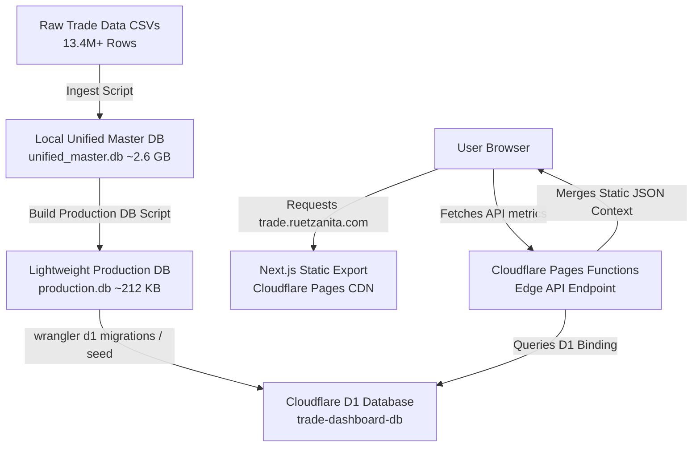

# canada-trade-visualizer
An interactive 3D geospatial dashboard visualizing Canada's macroeconomic trade relationships across the globe.
# 🍁 Canada Trade Visualizer

An interactive, premium 3D geospatial dashboard visualizing Canada's macroeconomic trade relationships across the globe. Built with Next.js, Cloudflare Pages, and Cloudflare D1, it highlights export volumes, year-over-year trends, and qualitative trade contexts.

[](https://trade.ruetzanita.com)
[](https://nextjs.org/)
[](https://www.cloudflare.com/)
[](https://sqlite.org/)
[](https://opensource.org/licenses/ISC)

---

## 🔗 Live Application
The production app is deployed and optimized for high-speed delivery at the edge:
👉 **[trade.ruetzanita.com](https://trade.ruetzanita.com)**

---

## ✨ Key Features

- **🌐 Interactive 3D Globe Visualizer**: Built with `react-globe.gl` and `Three.js`. Renders interactive geographic polygon overlays and dynamic camera auto-rotation. Highlights active regions like the **European Union (EUD)** and **Indo-Pacific (IPD)**.
- **📊 1-to-Many Trade Flow Sankey Diagram**: Built with `recharts`. Dynamically visualizes CAD export flow from Canada to partner nations. Implements automatic label collision avoidance to maintain a clean UI for smaller trade partners.
- **⏳ Timeline Scrubber & Trend Tracker**: An interactive year slider with dual YoY/YTD calculations. Displays global trade value fluctuations via a header AreaChart, featuring a dynamic data filter that automatically cuts off trailing data anomalies.
- **📄 Glassmorphism Country Profiles**: Collapsible floating panels presenting quantitative trade statistics alongside curated qualitative context paragraphs and frosted glass styling.
- **🔗 Source Verification**: Includes direct verification hyperlinks to original qualitative data sources for every partner country.

---

## 🏗️ Architecture & Data Flow

This application is built on a **Dual-Database Strategy** designed to maximize performance and bypass serverless storage constraints (such as Cloudflare D1's 500MB free tier storage cap):



### 1. Heavy Local Ledger (`unified_master.db` ~2.6 GB)
Acts as the local raw data ledger. It contains 13.4 million rows of raw historical trade data parsed recursively from Canadian trade CSV logs (`ODPF*.csv`) matching active country codes.

### 2. Lightweight Cloud Repository (`production.db` ~212 KB)
A highly optimized database containing aggregated monthly summaries (`macro_monthly_summary`) and index layouts. This compact database is deployed to Cloudflare D1, delivering lightning-fast query times at the edge while easily remaining within free-tier quotas.

---

## 🛠️ Technology Stack

- **Frontend**: Next.js 15 (Static Export / `output: 'export'`), React 19, TypeScript
- **Visualizations**: `react-globe.gl` (Three.js), `recharts` (Area charts & Sankey diagrams), `lucide-react`
- **Backend & Edge**: Cloudflare Pages, Cloudflare Pages Functions (Edge Runtime compatibility)
- **Database**: Cloudflare D1 (SQLite) locally driven by `better-sqlite3` and `@libsql/client`

---

## 📂 Project Directory Structure

```text
├── app/                  # Next.js frontend pages and components
│   ├── components/       # Reusable visualization components (Globe, Sankey)
│   ├── globals.css       # Core styling & custom animations
│   └── page.tsx          # Main dashboard view & client-side filters
├── db/                   # Database schemas, production SQLite database, and country contexts
│   ├── EUD_country_data.ts # Qualitative context for EU / EFTA countries
│   └── IPD_country_data.ts # Qualitative context for Indo-Pacific countries
├── docs/                 # Detailed architecture and developer manuals
├── functions/            # Cloudflare Pages Functions (Serverless Edge APIs)
├── scripts/              # Data ingestion and database compiling scripts
├── wrangler.toml         # Cloudflare Wrangler project configurations
└── package.json          # Dependency mappings & run scripts
```

---

## 🚀 Local Development & Setup

To run this project locally, follow these steps:

### 1. Prerequisites
- **Node.js**: `v18+` (v20+ recommended)
- **npm** or another package manager

### 2. Installation
Clone the repository and install all dependencies:
```bash
git clone https://github.com/your-username/canada-trade.git
cd canada-trade
npm install
```

### 3. Database Ingestion & Summary Compilation (Optional)
If you have raw trade data CSVs under `raw_data/` and want to rebuild the SQLite database from scratch:
```bash
# 1. Parse CSVs into local unified_master.db (Requires raw CSVs in raw_data/)
npm run ingest

# 2. Compile the summarized tables into production.db
node scripts/build_production_db.mjs
```

### 4. Running the Development Server
Start the Next.js local development server:
```bash
npm run dev
```
Open **[http://localhost:3000](http://localhost:3000)** in your browser to view the application.

---

## 🌐 Deployment to Cloudflare

This application is set up to compile as a static web build paired with native serverless Pages Functions:

1. Compile the static assets:
   ```bash
   npm run build
   ```
   *This outputs static HTML/CSS/JS bundles into `.vercel/output/static` (or your configured output directory).*

2. Publish to Cloudflare Pages using Wrangler:
   ```bash
   npx wrangler pages deploy .vercel/output/static
   ```

*Ensure that your Cloudflare D1 database is bound under the name `DB` in your Cloudflare dashboard console.*

---

## 📜 License
This project is licensed under the **ISC License**. See the [LICENSE.md](LICENSE.md) file for details.

---

*Made with 🍁 in Canada.*
