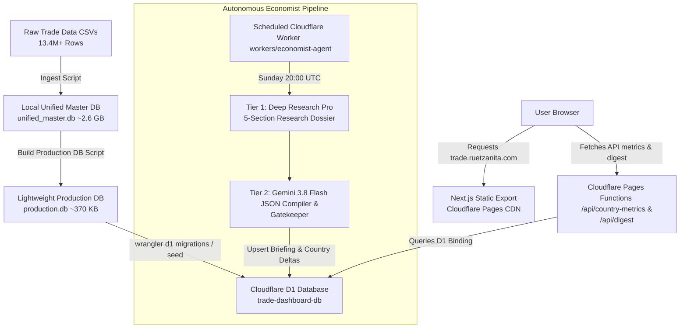

# 🍁 Canada Trade Visualizer

An interactive, premium 3D geospatial dashboard visualizing Canada's macroeconomic trade relationships across the globe. Built with Next.js, Cloudflare Pages, and Cloudflare D1, it highlights export volumes, year-over-year trends, and qualitative trade contexts.

[](https://trade.ruetzanita.com)
[](https://nextjs.org/)
[](https://www.cloudflare.com/)
[](https://sqlite.org/)
[](https://opensource.org/licenses/ISC)

---

## 🔗 Live Application
The production app is deployed and optimized for high-speed delivery at the edge:
👉 **[trade.ruetzanita.com](https://trade.ruetzanita.com)**

---

## ✨ Key Features

- **🌐 Interactive 3D Globe Visualizer**: Built with `react-globe.gl` and `Three.js`. Renders interactive geographic polygon overlays and dynamic camera auto-rotation. Highlights active trade regions: **European Union & EFTA (EUD)** and **Indo-Pacific (IPD)** with automatic cross-theater camera transitions.
- **🧠 Autonomous Trade Intelligence (AI Chief Economist)**: An automated two-tier agent pipeline operating on a weekly Sunday cron. Tier 1 harnesses **Deep Research Pro Preview** (`deep-research-pro-preview-12-2025`) to conduct comprehensive investigative sweeps across whitelisted watchdogs (Global Affairs Canada, Global Trade Alert, Hinrich Foundation, WTO). Tier 2 uses **Gemini 3.8 Flash** in JSON mode to compile long-form editorial briefings, primary source citations, and selective Country Card delta updates directly into Cloudflare D1.
- **📊 1-to-Many Trade Flow Sankey Diagram**: Built with `recharts`. Dynamically visualizes CAD export flows from Canada to partner nations, with automatic label collision avoidance.
- **⏳ Timeline Scrubber & Trend Tracker**: An interactive year slider with dual YoY/YTD calculations. Displays global trade value fluctuations via a header AreaChart with dynamic trailing data cutoff filters.
- **📄 Glassmorphism Country Profiles**: Collapsible floating panels presenting quantitative trade statistics alongside curated qualitative context paragraphs, timestamped deal/disruption bullets, and frosted glass styling.
- **🔗 Source Verification**: Includes direct verification hyperlinks to primary government and research sources for every partner country and weekly briefing.

---

## 🏗️ Architecture & Data Flow

This application is built on a **Dual-Database & Edge Agent Architecture** designed to maximize performance, automate intelligence, and bypass serverless storage constraints (such as Cloudflare D1's 500MB free-tier storage cap):


```mermaid
graph TD
    A[Raw Trade Data CSVs <br> 13.4M+ Rows] -- Ingest Script --> B[Local Unified Master DB <br> unified_master.db ~2.6 GB]
    B -- Build Production DB Script --> C[Lightweight Production DB <br> production.db ~370 KB]
    C -- wrangler d1 migrations / seed --> D[Cloudflare D1 Database <br> trade-dashboard-db]

    subgraph Autonomous Economist Pipeline
        W[Scheduled Cloudflare Worker <br> workers/economist-agent] -- Sunday 20:00 UTC --> T1[Tier 1: Deep Research Pro <br> 5-Section Research Dossier]
        T1 --> T2[Tier 2: Gemini 3.8 Flash <br> JSON Compiler & Gatekeeper]
        T2 -- Upsert Briefing & Country Deltas --> D
    end

    E[User Browser] -- Requests trade.ruetzanita.com --> F[Next.js Static Export <br> Cloudflare Pages CDN]
    E -- Fetches API metrics & digest --> G[Cloudflare Pages Functions <br> /api/country-metrics & /api/digest]
    G -- Queries D1 Binding --> D
```

### 1. Heavy Local Ledger (`unified_master.db` ~2.6 GB)
Acts as the local raw data ledger. It contains 13.4 million rows of raw historical trade data parsed recursively from Statistics Canada CIMT CSV logs (`ODPF*.csv`) matching active country codes.

### 2. Lightweight Cloud Repository (`production.db` ~370 KB)
A highly optimized database containing aggregated monthly summaries (`macro_monthly_summary`), dynamic qualitative context (`country_context`), and weekly briefings (`weekly_digests`). Deployed to Cloudflare D1, it delivers sub-second query times globally while consuming less than 0.1% of Cloudflare D1's 500MB free tier.

### 3. Autonomous Export Economist (`workers/economist-agent`)
A standalone scheduled worker executing every Sunday at 20:00 UTC. It investigates international trade developments, authors deep macroeconomic research, updates the public Trade Intelligence briefings, and maintains selective Year/Month event logs across 54 partner country profiles.

---

## 🛠️ Technology Stack

- **Frontend**: Next.js 15 (Static Export / `output: 'export'`), React 19, TypeScript
- **Visualizations**: `react-globe.gl` (Three.js), `recharts` (Area charts & Sankey diagrams), `lucide-react`
- **Backend & Edge**: Cloudflare Pages, Cloudflare Pages Functions (Edge Runtime), Cloudflare Workers (Cron Triggers)
- **Database**: Cloudflare D1 (SQLite) locally driven by `better-sqlite3` and `@libsql/client`
- **AI & Reasoning Models**: Google Generative AI (`deep-research-pro-preview-12-2025` via Interactions API, `gemini-3.8-flash` via JSON mode)

---

## 📂 Project Directory Structure

```text
├── app/                  # Next.js frontend pages and components
│   ├── components/       # Reusable visualization components (Globe, Sankey, ExpertDigestCard)
│   ├── globals.css       # Core styling & custom animations
│   └── page.tsx          # Main dashboard view & client-side filters
├── db/                   # Database schemas, migrations, production SQLite, and country contexts
│   ├── geo_metadata.ts   # 57-country whitelist and region mappings
│   ├── migrations/       # Schema migration SQL files
│   ├── EUD_country_data.ts # Context for EU / EFTA countries
│   └── IPD_country_data.ts # Context for Indo-Pacific countries
├── docs/                 # Detailed architecture, storage specs, and model task definitions
│   ├── ARCHITECTURE.md   # System architecture and API specifications
│   ├── Canada_Trade_Storage_Architecture.md # Storage architecture and quota metrics
│   ├── ECONOMIST_MODEL_TASKS.md # Autonomous Economist model directives & tasks
│   └── LATEST_RESEARCH_PUBLICATION.md # Active Tier 1 publication archive
├── functions/            # Cloudflare Pages Functions (Serverless Edge APIs)
│   └── api/              # /api/country-metrics and /api/digest endpoints
├── scripts/              # Ingestion, database compilation, and agent runner scripts
│   ├── run_economist_dry_run.mjs # Offline verification script for two-tier economist
│   └── build_production_db.mjs   # Production SQLite builder
├── workers/              # Cloudflare Workers
│   └── economist-agent/  # Autonomous weekly economist pipeline
├── wrangler.toml         # Cloudflare Wrangler project configurations
└── package.json          # Dependency mappings & run scripts
```

---

## 🚀 Local Development & Setup

To run this project locally, follow these steps:

### 1. Prerequisites
- **Node.js**: `v18+` (v20+ recommended)
- **npm** or another package manager

### 2. Installation
Clone the repository and install all dependencies:
```bash
git clone https://github.com/your-username/canada-trade.git
cd canada-trade
npm install
```

### 3. Database Ingestion & Summary Compilation (Optional)
If you have raw trade data CSVs under `raw_data/` and want to rebuild the SQLite database from scratch:
```bash
# 1. Parse CSVs into local unified_master.db (Requires raw CSVs in raw_data/)
npm run ingest

# 2. Compile the summarized tables into production.db
node scripts/build_production_db.mjs
```

> **Data Source Note:** Raw datasets are sourced from the Open Government Portal ([Dataset 2909a648-5753-4924-878a-b069392d9cde](https://open.canada.ca/data/en/dataset/2909a648-5753-4924-878a-b069392d9cde)) via direct bulk `.zip` endpoints: `https://www150.statcan.gc.ca/n1/pub/71-607-x/2021004/zip/CIMT-CICM_Dom_Exp_YYYY.zip`. Do not use the interactive web table exporter which caps at 150,000 rows. See [docs/README.md](docs/README.md) for full ingestion details.


### 4. Running the Development Server
Start the Next.js local development server:
```bash
npm run dev
```
Open **[http://localhost:3000](http://localhost:3000)** in your browser to view the application.

---

## 🌐 Deployment to Cloudflare

This application is set up to compile as a static web build paired with native serverless Pages Functions:

1. Compile the static assets:
   ```bash
   npm run build
   ```
   *This outputs static HTML/CSS/JS bundles into `.vercel/output/static` (or your configured output directory).*

2. Publish to Cloudflare Pages using Wrangler:
   ```bash
   npx wrangler pages deploy .vercel/output/static
   ```

*Ensure that your Cloudflare D1 database is bound under the name `DB` in your Cloudflare dashboard console.*

---

## 📜 License
This project is licensed under the **ISC License**. See the [LICENSE.md](LICENSE.md) file for details.

---

*Made with 🍁 in Canada.*
