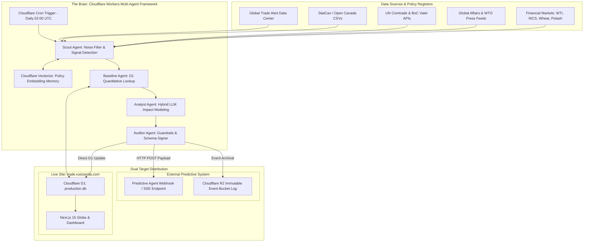
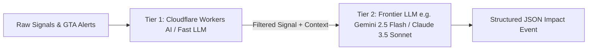

# 🍁 Autonomous Trade & Market Impact AI Agent: Architecture Blueprint

## 1. Executive Summary & Vision

The **Canada Trade Autonomous AI Agent** (*"TradeSentinel"*) expands the Canada Trade Visualizer from a historical reporting dashboard into a proactive **real-time market intelligence and predictive impact platform**. 

### Core Responsibilities:
1. **Automated Monthly Refresh:** Ingest and aggregate monthly Statistics Canada merchandise trade data as soon as published (~35 days after month-end), updating the live Cloudflare D1 edge database (`production.db`).
2. **Policy & Market Intelligence Parsing:** Continuously monitor global trade agreements, bilateral tariffs, regulatory actions (powered by **Global Trade Alert** & news feeds), and commodity price dynamics to forecast commodity-level impacts, timelines, and dollar values per tracked country.
3. **Live Site Integration:** Feed real-time updates and forward-looking impact indicators directly to [trade.ruetzanita.com](https://trade.ruetzanita.com) (Cloudflare D1 database + dynamic Globe & Country UI components).
4. **Downstream Predictive Agent Dispatch:** Standardize, cryptographically sign, and emit structured `TradeImpactEventPayload` streams to feed a separate downstream predictive modeling agent.

---

## 2. End-to-End System Architecture (Cloudflare Native)



---

## 3. Data Inputs & API Ecosystem

To balance financial cost, reliability, and coverage, the agent uses a multi-tier data ingestion strategy:

| Category | Source / API | Endpoint / Access Method | Data Frequency | Output Data / Metrics |
| :--- | :--- | :--- | :--- | :--- |
| **Global Trade Policy Interventions** | **Global Trade Alert (GTA) Data Center** | `globaltradealert.org/data-center` (API / Bulk CSV Data Dump) | Daily / Real-time | World-leading trade intervention register: Tariffs, subsidies, anti-dumping duties, SPS measures, 6-digit HS product codes. |
| **Primary Quantitative Trade Data** | Statistics Canada / Open Government | Open Canada Data API / Direct CSV Downloads (`ODPF*.csv`) | Monthly (~35th day after month end) | Monthly CAD export/import totals by country and HS product code. |
| **Currency & Macro Baseline** | Bank of Canada (Valet API) | `api.bankofcanada.ca/valet/observations` | Daily / Monthly | CAD/USD, CAD/EUR, CAD/JPY exchange rates for real-value adjustment. |
| **Global Trade Comparisons** | UN Comtrade API v1 | `comtradeapi.un.org/public/v1/preview` | Monthly / Annual | Partner-reported trade flows for counter-verification. |
| **Official Trade Agreements & Policy** | Global Affairs Canada (GAC) | RSS Feeds / Web Scraping Press Releases & Treaty Texts | Real-time / Daily | CUSMA/USMCA, CETA, CPTPP, bilateral tariff announcements, sanctions. |
| **Commodity Market Prices** | Trading Economics / Alpha Vantage / FMP | REST API / Websocket | Daily / Hourly | WTI Crude, WCS (Western Canadian Select), Wheat, Canola, Potash, Uranium, Gold, Copper. |
| **Global News & Unstructured Intelligence** | Tavily / NewsAPI / GDELT Project | REST API Search / GDELT BigQuery export | Real-time / Daily | Filtered news on port strikes, trade sanctions, supply chain bottlenecks. |

---

## 4. The Brain: Recommended LLM Architecture & Orchestration

To run reliably within serverless Cloudflare Workers execution limits while achieving deep economic reasoning, "The Brain" is structured as a **Multi-Agent Hybrid Intelligence Network**.

### A. Model Selection & Hybrid Intelligence Tiering



1. **Tier 1 — Fast Signal Screener (Cloudflare Workers AI):**
   * **Model:** `@cf/meta/llama-3.3-70b-instruct` or `@cf/deepseek-ai/deepseek-r1-distill-qwen-32b`
   * **Role:** Zero-latency screening of news items, RSS feeds, and raw GTA intervention tables. Filters out 95% of non-actionable noise before invoking main reasoning.
2. **Tier 2 — Frontier Economic Reasoner (Gemini / Anthropic / OpenAI via Fetch API):**
   * **Model:** **Gemini 2.5 Flash** or **Claude 3.5 Sonnet**
   * **Role:** High-reasoning evaluation of complex trade agreements, calculating economic exposure, determining elasticity, generating strict Zod-validated JSON output, and summarizing natural language insights.

### B. Modular Sub-Agents (Running in Workers / Durable Objects)

* **`ScoutAgent`:** Fetches GTA Data Center updates, GAC RSS, and news. Computes vector embeddings using Cloudflare Workers AI (`@cf/baai/bge-large-en-v1.5`) and checks **Cloudflare Vectorize** to prevent duplicate reporting of the same policy across news cycles.
* **`BaselineAgent`:** Queries Cloudflare D1 (`macro_monthly_summary`) for ground-truth historical trade values. *Rule: The LLM is never allowed to guess baseline export numbers.*
* **`AnalystAgent`:** Receives `(Event Signal + D1 Historical Baseline + Commodity Prices)`. Executes deterministic financial formulas:
  $$\text{Impact CAD} = \text{D1 Baseline Export} \times \text{HS Commodity Share} \times \Delta \text{Tariff/Elasticity Factor}$$
* **`AuditorAgent`:** Validates JSON schema adherence, signs the payload with an Ed25519 private key, updates D1, and dispatches the payload downstream.

---

### C. LLM Extraction Schema (`TradeImpactEvent`)
```typescript
export interface TradeImpactEvent {
  eventId: string;                   // UUID v4
  timestamp: string;                 // ISO 8601 creation date
  countryIso: string;                // ISO 3166-1 alpha-2 (e.g. 'DE', 'JP', 'US')
  countryName: string;               // e.g. 'Germany'
  regionCode: 'EUD' | 'IPD' | 'NAFTA' | 'OTHER';
  
  // Policy & Categorization
  eventType: 'TARIFF_CHANGE' | 'TRADE_AGREEMENT' | 'SANCTION' | 'EXPORT_RESTRICTION' | 'COMMODITY_SHOCK' | 'INFRASTRUCTURE_DISRUPTION';
  severity: 'LOW' | 'MEDIUM' | 'HIGH' | 'CRITICAL';
  gtaInterventionId?: string;       // Global Trade Alert ID (if sourced via GTA)
  
  // Financial & Commodity Targeting
  affectedCommodityHsCode?: string;  // e.g. '2709' (Crude Petroleum) or '1001' (Wheat)
  affectedCommodityName: string;     // e.g. 'Western Canadian Select Crude'
  estimatedValueImpactCad: number;   // Numerical estimate (e.g., -450000000)
  impactDirection: 'POSITIVE' | 'NEGATIVE' | 'NEUTRAL_MIXED';
  
  // Temporal Boundaries
  impactStartDate: string;           // YYYY-MM-DD
  impactPeakDate?: string;           // YYYY-MM-DD
  impactEndDate?: string;            // YYYY-MM-DD or null if permanent
  
  // Confidence & Verification
  confidenceScore: number;          // 0.00 to 1.00
  reasoningSummary: string;          // Concise narrative explaining the targeted calculation
  verbatimExcerpt: string;           // Key quote from original text
  sourceName: string;                // e.g. 'Global Trade Alert' / 'Global Affairs Canada'
  sourceUrl: string;                 // Direct canonical link
}
```

---

## 5. Live Site Integration (`trade.ruetzanita.com`)

### A. Cloudflare D1 Database Schema Extension
Add a new table `forward_impact_events` to `production.db`:

```sql
CREATE TABLE IF NOT EXISTS forward_impact_events (
  id TEXT PRIMARY KEY,
  country_iso TEXT NOT NULL,
  event_type TEXT NOT NULL,
  severity TEXT NOT NULL,
  commodity_name TEXT NOT NULL,
  hs_code TEXT,
  estimated_value_cad REAL NOT NULL,
  impact_direction TEXT NOT NULL,
  start_date TEXT NOT NULL,
  end_date TEXT,
  confidence_score REAL NOT NULL,
  summary TEXT NOT NULL,
  source_url TEXT NOT NULL,
  gta_id TEXT,
  created_at TIMESTAMP DEFAULT CURRENT_TIMESTAMP,
  FOREIGN KEY (country_iso) REFERENCES macro_monthly_summary(country_iso)
);

CREATE INDEX IF NOT EXISTS idx_impact_country ON forward_impact_events(country_iso);
CREATE INDEX IF NOT EXISTS idx_impact_start ON forward_impact_events(start_date);
```

### B. UI Component Enhancements for Live Site
1. **Forward Timeline Scrubber:** Extend the timeline scrubber into target future dates (e.g., Q3 2026 - Q4 2027) showing projected impact curves alongside historical actuals.
2. **Globe Visualizer Overlay:** Pulsing warning rings or glowing alert arcs over country targets with active high-severity trade impacts.
3. **Country Profile Drawer:** A new **"⚡ Forward Impact & Market Horizon"** tab displaying active tariff changes, commodity risk scores, and GTA source links.

---

## 6. Downstream Integration: Feeding the Predictive Agent

The agent functions as a trusted upstream intelligence publisher for your broader predictive system.

### A. Standardized Downstream Payload (`TradeImpactEventPayload`)
```json
{
  "specversion": "1.0",
  "publisher": "trade-sentinel-agent.canada-trade",
  "event_id": "evt_98f12a3b-4c5d-6e7f-8a9b-0c1d2e3f4a5b",
  "event_type": "canada.trade.impact.forecast",
  "time": "2026-08-12T12:00:00Z",
  "signature": "ed25519_sig_abc123...",
  "data": {
    "target_country_iso": "JP",
    "region": "IPD",
    "commodity": {
      "name": "Canola Seed & Oils",
      "hs_code": "1205"
    },
    "impact_metrics": {
      "estimated_annual_value_cad": 185000000,
      "direction": "POSITIVE",
      "delta_percentage": 0.12,
      "confidence": 0.88
    },
    "timeline": {
      "effective_start": "2026-10-01",
      "duration_months": 24
    },
    "driver": {
      "policy_name": "CPTPP Tariff Phase-Out Schedule - Year 8 Reduction",
      "gta_id": "GTA-2026-9921",
      "summary": "Scheduled tariff reduction on Canadian canola oil imports into Japan taking effect Oct 2026.",
      "source_url": "https://www.globaltradealert.org/state-act/9921"
    }
  }
}
```

### B. Reliable Delivery Mechanisms
- **Primary: HTTP Webhook / SSE Endpoint:** Direct POST request to the predictive agent's ingestion gateway.
- **Secondary: Cloudflare R2 Event Stream:** Push an immutable JSON artifact to an R2 storage bucket (`s3://trade-impact-feed/events/2026/08/evt_...json`), enabling event replay and offline batch consumption.
- **Cryptographic Provenance:** Payloads are signed with an Ed25519 private key so the predictive agent can verify origin and data integrity.

---

## 7. Operational Deployment & Guardrails (Cloudflare Serverless)

### Execution Model: Cloudflare Workers + Cron Triggers
* **Worker Schedule:** Daily Cron trigger at `02:00 UTC`.
* **Stateful Storage & Memory:** 
  * Cloudflare D1 for quantitative baselines and live site state.
  * Cloudflare Vectorize for policy semantic memory & deduplication.
  * Cloudflare R2 for raw payload event logging.

### Circuit Breakers & Quality Control:
- **Grounding Rule:** Financial estimates must be grounded in D1 historical baselines multiplied by explicit policy terms. The LLM is prohibited from outputting floating baseline trade totals without D1 lookup verification.
- **MoM Data Spike Breaker:** If StatCan monthly ingest shows a >40% MoM anomaly, the update is flagged for review before writing to production D1.
